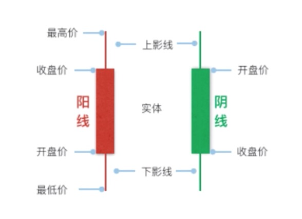

# Stock-Data-Analysis&Prediction
 获取股票历史数据，并实现快速绘图。计算买入和卖出过程中的收益，并标记出涨跌转折点。最后，使用机器学习方法对数据进行建模，并给出股票未来走势的预测结果。

### 环境
> Python 3.6
>
> Quandl
 - 免费的金融数据模块，50次/天访问请求（访客）
 - 从上市到至今的股票信息（更新不及时）
> pandas_datareader(推荐)
 - 获得实时数据
 - 开盘价，最高价，最低价，收盘价，成交量，调整后的收盘价
> mpl_finance
>
> fbprophet
>
### 实现
> 股票数据获取
>
>数据预处理
>
>股价涨跌变化
>
>股票走势预测

### k线图
